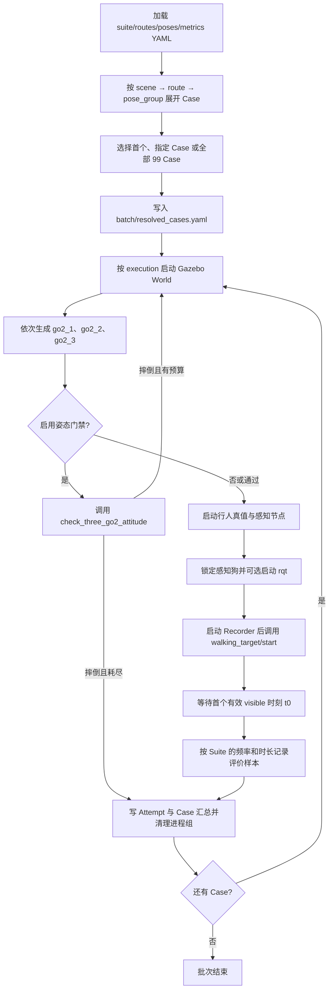

# Go2 目标感知自动化测试框架

`go2_test_framework` 是面向三只 Go2 仿真的目标感知测试包。它从 YAML 展开测试工况，按 Case 独立启动 Gazebo、三只机器人、行人真值、目标感知和记录节点，然后计算识别准确率与定位相对误差并保存完整结果。

测试编排与业务算法分离：本包负责“怎样测、记录什么、如何判定”，目标检测、深度定位和角色选择仍由 `go2_target_perception` 提供。

> 当前配置基线：评价频率 `2 Hz`、最近样本匹配容差 `0.4 s`。正式 99 Case 套件评价 `10 s`，完整窗口为 `20` 行样本；默认 smoke 套件评价 `30 s`，完整窗口为 `60` 行样本。

## 1. 当前能力与边界

当前已经实现：

- 由 YAML 稳定展开 `scene × route × pose_group`，正式套件共 99 个 Case。
- 支持默认 smoke、指定单个 Case、指定多个 Case以及显式运行全部 Case。
- 为每个 Case 使用独立进程组，结束时只清理本 Case 启动的进程。
- 使用相机内参、机器人真值、目标真值和 TF 判断目标是否位于相机画面内。
- 在统一 ROS 仿真时钟上采样，匹配感知状态与定位结果，并禁止重复消费同一状态样本。
- 输出原始 CSV、识别指标、定位指标、Case 汇总和各进程日志。
- 支持由 suite 配置并由 CLI 覆盖 Gazebo GUI、所选感知狗的 rqt 调试图和三狗姿态门禁。
- 姿态门禁确认摔倒后可重启当前 Case；每个 Attempt 独立留档，耗尽后记录基础设施失败并继续下一 Case。
- 输出批次汇总；批次执行完毕后以退出码反映是否存在基础设施失败。
- 从路线 YAML 生成并检查 9 个固定 World。

当前仍未实现：

- 不自动打开 RViz；rqt 只显示锁定感知狗的检测调试图。
- 不启动建图、Nav2、围捕和 tracking 控制器。

## 2. 目录与文件职责

```text
go2_test_framework/
├── README.md                         # 本文档
├── package.xml                       # ROS 2 包依赖
├── setup.py                          # Python 包、资源和 console scripts 安装定义
├── setup.cfg                         # ament_python 脚本安装位置
├── resource/go2_test_framework       # ament 资源索引标记
├── config/
│   ├── suites/
│   │   ├── T1_smoke_city.yaml        # city/rectangle 单 Case 联调套件
│   │   └── T1_target_test.yaml       # 3×3×11 = 99 Case 正式套件
│   ├── parameters/
│   │   ├── target_routes.yaml        # 三个场景、三种路线及 World 来源
│   │   └── robot_pose_groups.yaml    # group_01～group_11 三狗绝对位姿
│   └── metrics/
│       ├── recognition.yaml          # 识别通过阈值
│       └── localization.yaml         # 定位相对误差通过阈值
├── worlds/
│   ├── city_{straight,rectangle,v_shape}.world
│   ├── forest_{straight,rectangle,v_shape}.world
│   └── airport_{straight,rectangle,v_shape}.world
├── launch/
│   └── target_test.launch.py         # 单独启动 Recorder 的 launch；Runner 当前未调用它
├── go2_test_framework/
│   ├── common/config.py              # YAML 读取、字段校验、resolved 位姿检查
│   ├── runner/
│   │   ├── cases.py                  # Case 展开、编号和 Case ID 生成
│   │   ├── main.py                   # CLI、批次循环和最终退出码
│   │   ├── orchestration.py          # Attempt 执行、Case 重试和结果聚合
│   │   ├── processes.py              # 独立进程组、姿态日志 tee 和回收
│   │   ├── runtime.py                # 批次锁、残留恢复和退出信号
│   │   └── ros_wait.py               # transient-local 感知角色等待
│   ├── common/execution.py           # execution 配置模型、校验和 CLI 覆盖
│   ├── recorders/
│   │   ├── cache.py                  # 最近时间样本缓存及一次性消费
│   │   └── target_recorder.py        # 角色锁定、可见性、定时采样和 CSV 记录
│   ├── ground_truth/visibility.py    # 相机投影和姿态坐标计算
│   ├── evaluators/
│   │   ├── recognition.py            # 识别准确率计算
│   │   └── localization.py           # 平均二维相对定位误差计算
│   ├── reporting/results.py          # CSV 离线评价及 YAML 汇总输出
│   └── world_generator.py            # 由路线 YAML 生成/检查 9 个 World
└── test/
    ├── test_cases_and_config.py       # 配置、99 Case 顺序和 unresolved 检查
    ├── test_cache_visibility.py       # 时间匹配、禁止复用和相机投影测试
    ├── test_metrics.py                # 指标、零样本和零参考距离测试
    └── test_world_generator.py        # World 生成和轨迹一致性测试
```

安装后提供三个命令：

| 命令                     | 用途                                    |
| ------------------------ | --------------------------------------- |
| `target_test_runner`   | 展开、选择并执行 Case                   |
| `target_test_recorder` | 记录单个已解析 Case，通常由 Runner 启动 |
| `generate_test_worlds` | 生成 World 或执行`--check` 漂移检查   |

## 3. 架构与核心流程



### 3.1 Case 展开与选择

正式套件固定按以下顺序展开：

1. `scene`：`city`、`forest`、`airport`
2. `route`：`straight`、`rectangle`、`v_shape`
3. `pose_group`：`group_01`～`group_11`

因此正式 Case 的 `case_index` 稳定为 `1..99`，Case ID 示例为：

- `T1-CITY-STRAIGHT-G01`
- `T1-FOREST-RECTANGLE-G05`
- `T1-AIRPORT-V-G11`

没有提供 `--case-id` 或 `--all` 时，Runner 只选择展开结果中的第一个 Case。默认 suite 是 smoke，因此不带选择参数时运行 `T1-SMOKE-CITY-RECTANGLE-SMOKE_DEFAULT`。

`--all` 和 `--case-id` 不能同时使用。重复提供 `--case-id` 时，执行顺序就是命令行中给出的顺序；结果目录仍保留 Case 在完整 suite 中的全局编号。

### 3.2 单个 Case 的实际启动顺序

Runner 对每个 Case 执行以下操作：

1. 创建 `case_<index>` 目录并写入 `case_config.yaml`，终端输出当前 `Attempt N/总数`。
2. 按 resolved execution 的 `gazebo_gui` 启动固定 World；只有当前 Attempt 进程组内的 `gzserver` 存活时，才等待 `/spawn_entity`、`/walking_target/start` 和 `/clock`，旧 ROS graph 不能冒充新 World。
3. World 就绪后等待 `world_to_first_delay_sec`，再按 YAML 位姿依次生成三只 Go2；相机固定开启，激光雷达由 `enable_lidar` 控制。
4. 每只狗必须等待两个 controller active，以及 odom、ground truth 和 RGB-D topic 出现；雷达开启时还会等待 `velodyne_points`。前两只狗就绪后分别等待 `inter_robot_delay_sec` 再生成下一只。
5. 三只狗全部就绪后等待 `settle_delay_sec`，再调用 `check_three_go2_attitude`；五帧 roll、缺失模型、通过或倾倒结论会实时显示在主终端，并完整保存在 `attitude_check.log`。任一帧出现 `abs(roll) > 90°` 就以退出码 10 触发当前 Case 重启，其他非零退出码直接记为基础设施失败。
6. 姿态通过后启动 `actor_state_publisher` 和 `three_go2_target_tracking.launch.py`。
7. 使用 transient-local QoS 等待 `/target_role/perception_robot`；启用 rqt 时打开所选狗的 `target_perception/debug_image`。
8. 启动 Recorder，然后调用 `/walking_target/start`；Recorder 可以通过 latched 消息锁定同一只感知狗。
9. 第一次拿到完整真值、CameraInfo、TF 且 `visible=true` 的评价时刻成为 `t0`，从此按 suite 频率记录并离线计算指标。
10. 每次 Attempt 无论成功、摔倒或异常都独立保存结果，并对所属进程组先发送 `SIGTERM`，超时后再发送 `SIGKILL`。

### 3.3 采样、匹配与可见性

- 评价样本数为 `round(evaluation_rate_hz × evaluation_duration_sec)`；当前是 60。
- `t0` 之前只等待，不写入正式评价窗口；目标始终不可见或数据未就绪会触发超时失败。
- 目标真值、感知狗真值、JSON 状态和估计 odom 分别进入时间缓存。
- 每个评价时刻在 `match_timeout_sec` 内选择最近样本；感知状态和估计样本只能被消费一次。
- 成功定位状态必须用相同传感器时间戳匹配 estimated odom。
- 可见性由 CameraInfo 内参投影判断：目标在有效深度 `0.3～25.0 m` 且投影像素位于画面内才是 `visible=true`。
- 第一阶段不判断建筑、树木等遮挡。

## 4. 配置与输入

### 4.1 Suite 配置

`config/suites/T1_target_test.yaml` 是 99 Case 正式套件，`T1_smoke_city.yaml` 是单 Case 联调套件。常用字段如下：

| 字段                                            | 当前值/含义                                       |
| ----------------------------------------------- | ------------------------------------------------- |
| `formal`                                      | 是否是正式套件；smoke 为`false`                 |
| `scenes`                                      | 要展开的场景及顺序                                |
| `routes`                                      | 要展开的路线及顺序                                |
| `pose_groups`                                 | 要展开的位姿组及顺序                              |
| `evaluation_rate_hz`                          | `2.0`，评价定时器频率，不是相机或 YOLO 发布频率 |
| `evaluation_duration_sec`                     | `30.0`，从 `t0` 开始的评价时长                |
| `match_timeout_sec`                           | `0.4`，评价时刻与最近消息允许的最大时间差       |
| `startup_timeout_sec`                         | 整体数据准备上限                                  |
| `role_timeout_sec`                            | 等待感知角色的上限                                |
| `data_ready_timeout_sec`                      | 角色选出后等待首个完整可见数据的上限              |
| `min_camera_depth_m` / `max_camera_depth_m` | 相机有效深度范围                                  |

两个 suite 还包含独立于评价协议的 `execution` 段，以下是 smoke 的默认配置示例：

```yaml
execution:
  gazebo_gui: false
  rqt: false
  robot_startup:
    world_to_first_delay_sec: 3.0
    inter_robot_delay_sec: 3.0
    enable_lidar: false
  attitude_check:
    enabled: true
    settle_delay_sec: 3.0
    roll_limit_deg: 90.0
    sample_frames: 5
    timeout_sec: 10.0
    max_restarts: 3
    restart_delay_sec: 1.0
```

World 与第一只狗之间、相邻两只狗之间默认各等待 3 秒。三只狗的 controller 和必要 topic 全部就绪后，Runner 再等待 `settle_delay_sec`，然后观察最多 `sample_frames` 个完整姿态帧；任意一帧 roll 超限立即失败，全部正常才通过。`max_restarts` 是首次 Attempt 之外允许的重启次数，所以 Attempt 总上限为 `max_restarts + 1`。只有姿态检查退出码 10 会消耗该预算；指标不通过、启动失败或姿态检查器自身错误均不重试。

降低 `evaluation_rate_hz` 会减少固定时间内的评价点，也更容易让低频推理结果覆盖评价时刻。增大 `match_timeout_sec` 会放宽时间匹配，但也允许使用离评价时刻更远的数据。二者可以提高匹配覆盖率，却会改变测试协议；正式比较不同批次时必须保持相同参数，并以每批的 `resolved_cases.yaml` 为准。

### 4.2 路线与 World

`config/parameters/target_routes.yaml` 按场景定义：

- `base_world`：生成该场景测试 World 时使用的基础 SDF。
- `points`：二维路径点。
- `traversal`：`closed` 为闭环，`ping_pong` 为沿原路径往返。
- `speed`：行人轨迹速度。
- `turn_duration`：每个拐点的转向时间。
- `provisional`：该路线是否只用于临时验证。

生成器只替换基础 World 中 `walking_target` 的 walking trajectory。修改路线后必须重新生成 9 个 World并提交；`--check` 只比较，不写文件。

### 4.3 三狗位姿

`config/parameters/robot_pose_groups.yaml` 使用全场景共用的绝对坐标，每组必须包含 `go2_1`、`go2_2`、`go2_3` 的：

```yaml
x: 0.0
y: 0.0
z: 0.4
yaw: 0.0
```

只有 `resolved: true` 的位姿组可以启动。若为 `false`，Runner 在启动 ROS 进程前报错，提示对应 pose group 未解析。

smoke 的 `smoke_default` 位姿直接写在 `T1_smoke_city.yaml` 的 `inline_pose_groups` 中，不属于正式 11 组位姿。

### 4.4 指标和模型

- `config/metrics/recognition.yaml`：识别准确率阈值，当前为 `80%`。
- `config/metrics/localization.yaml`：平均相对定位误差阈值，当前为 `15%`。
- `--model-path`：传给 `go2_target_perception` 的 YOLO 权重文件，Runner 启动前要求该文件真实存在。

仓库根目录当前可使用 `yolov8s.pt`。从其他目录运行时应传绝对路径，避免相对路径指向错误位置。

### 4.5 ROS 数据输入接口

Runner 负责启动数据生产节点，Recorder 实际消费以下接口：

| 接口                                       | 类型                           | 用途                                           |
| ------------------------------------------ | ------------------------------ | ---------------------------------------------- |
| `/target_role/perception_robot`          | `std_msgs/msg/String`        | 锁定本 Case 的感知狗                           |
| `/walking_target/odom`                   | `nav_msgs/msg/Odometry`      | 行人世界真值                                   |
| `/go2_N/odom/ground_truth`               | `nav_msgs/msg/Odometry`      | 感知狗世界真值                                 |
| `/go2_N/camera/depth/camera_info`        | `sensor_msgs/msg/CameraInfo` | 分辨率、相机内参与 optical frame               |
| `/go2_N/target_perception/result_status` | `std_msgs/msg/String`        | 每个已处理 RGB-D 样本的识别/定位状态 JSON      |
| `/go2_N/target_estimated/odom`           | `nav_msgs/msg/Odometry`      | 定位成功时的目标估计                           |
| `/tf`、`/tf_static`                    | TF2                            | `base_footprint` 到相机 optical frame 的变换 |

其中 `go2_N` 是角色选择器锁定的 `go2_1`、`go2_2` 或 `go2_3`。目标感知节点在上游读取 `/go2_N/camera/image_raw` 和 `/go2_N/camera/depth/image_raw`，Recorder 不直接保存图像。

`result_status` 的字符串内容是严格 JSON，例如：

```json
{
  "schema_version": 1,
  "stamp": {"sec": 123, "nanosec": 400000000},
  "sample_id": 42,
  "recognition_success": true,
  "confidence": 0.91,
  "bbox": [100.0, 80.0, 220.0, 420.0],
  "localization_success": true
}
```

YOLO 未识别时两个 success 均为 `false`；识别成功但深度或 TF 失败时，只保留 `recognition_success: true`。不可用的 `confidence` 或 `bbox` 使用 JSON `null`，不会发布 NaN。

## 5. 构建与运行

以下命令均假设仓库位于 `/home/bit/go2_target_seek_delivery`，ROS 2 发行版为 Humble。

Runner 的主要参数：

| 参数                                           | 行为                                         |
| ---------------------------------------------- | -------------------------------------------- |
| `--suite PATH`                               | 指定 suite；默认使用`T1_smoke_city.yaml`   |
| `--routes PATH`                              | 覆盖路线 YAML                                |
| `--pose-groups PATH`                         | 覆盖正式位姿组 YAML                          |
| `--recognition-metrics PATH`                 | 覆盖识别阈值 YAML                            |
| `--localization-metrics PATH`                | 覆盖定位阈值 YAML                            |
| `--case-id ID`                               | 选择一个 Case，可重复指定                    |
| `--all`                                      | 选择 suite 展开的全部 Case                   |
| `--model-path PATH`                          | 指定 YOLO 权重                               |
| `--results-root PATH`                        | 指定结果根目录                               |
| `--dry-run`                                  | 只校验和解析配置，不启动 ROS                 |
| `--gui` / `--no-gui`                       | 覆盖 suite 的 Gazebo GUI 设置                |
| `--rqt` / `--no-rqt`                       | 覆盖 suite 的所选感知狗调试图设置            |
| `--lidar` / `--no-lidar`                   | 覆盖 suite 的三狗雷达启动与就绪检查设置      |
| `--check-attitude` / `--no-check-attitude` | 覆盖 suite 的三狗姿态门禁设置                |
| `--max-restarts N`                           | 覆盖确认摔倒后的最大重启次数，必须为非负整数 |

CLI 未显式提供的选项继承 suite；合并后的完整 execution 配置会写入 `resolved_cases.yaml`。

### 5.1 ROS 环境与选择性构建

```bash
cd /home/bit/go2_target_seek_delivery
conda deactivate
which python3
```

`which python3` 必须输出：

```text
/usr/bin/python3
```

然后执行：

```bash
source /opt/ros/humble/setup.bash
cd /home/bit/go2_target_seek_delivery/go2_ws_v2
colcon build --packages-select go2_target_perception go2_test_framework
source install/setup.bash
cd /home/bit/go2_target_seek_delivery
```

不要在 conda 环境中运行 ROS、pytest、Gazebo 或 RViz，否则可能出现 `rclpy._rclpy_pybind11`、`lxml` 等依赖冲突。

### 5.2 检查生成 World 是否漂移

```bash
ros2 run go2_test_framework generate_test_worlds \
  --config go2_ws_v2/src/go2_test_framework/config/parameters/target_routes.yaml \
  --repo-root /home/bit/go2_target_seek_delivery \
  --output-dir go2_ws_v2/src/go2_test_framework/worlds \
  --check
```

成功时输出 `checked 9 test worlds`。若提示 `generated worlds are out of date`，说明路线 YAML、基础 World 和已提交测试 World 不一致。

确实修改路线并需要重新生成时，去掉 `--check`；该操作会覆写 `worlds/` 下的 9 个生成文件。

### 5.3 dry-run：只解析，不启动 ROS

dry-run 仍会创建批次目录并写 `resolved_cases.yaml`，建议把输出放到 `/tmp`：

```bash
ros2 run go2_test_framework target_test_runner \
  --suite go2_ws_v2/src/go2_test_framework/config/suites/T1_target_test.yaml \
  --case-id T1-CITY-STRAIGHT-G01 \
  --results-root /tmp/go2_test_framework_dry_run \
  --dry-run
```

检查全部 99 Case 是否都能展开和解析：

```bash
ros2 run go2_test_framework target_test_runner \
  --suite go2_ws_v2/src/go2_test_framework/config/suites/T1_target_test.yaml \
  --all \
  --results-root /tmp/go2_test_framework_dry_run \
  --dry-run
```

成功时应显示 `resolved 99 case(s)`。

### 5.4 运行默认 smoke Case

```bash
cd /home/bit/go2_target_seek_delivery
ros2 run go2_test_framework target_test_runner \
  --model-path /home/bit/go2_target_seek_delivery/yolov8s.pt
```

默认只运行 `T1_smoke_city.yaml` 的第一个且唯一 Case。smoke 的 `formal: false`，因此即使两个指标都通过，`case_summary.yaml` 中总体 `pass` 仍为 `false`，并标明它不是正式结果。

### 5.5 单独运行一个正式 Case

```bash
ros2 run go2_test_framework target_test_runner \
  --suite go2_ws_v2/src/go2_test_framework/config/suites/T1_target_test.yaml \
  --case-id T1-FOREST-RECTANGLE-G01 \
  --model-path /home/bit/go2_target_seek_delivery/yolov8s.pt
```

建议首次验证新场景或新位姿时始终先运行单 Case，不要直接运行 99 Case。

### 5.6 运行一个小批量

重复使用 `--case-id`：

```bash
ros2 run go2_test_framework target_test_runner \
  --suite go2_ws_v2/src/go2_test_framework/config/suites/T1_target_test.yaml \
  --case-id T1-CITY-RECTANGLE-G01 \
  --case-id T1-FOREST-RECTANGLE-G01 \
  --case-id T1-AIRPORT-RECTANGLE-G01 \
  --model-path /home/bit/go2_target_seek_delivery/yolov8s.pt
```

这是正式跑 99 Case 前推荐的小规模检查方式，可优先确认三种场景中小狗朝向、目标可见性、TF 和相机数据。

### 5.7 运行全部 99 Case

```bash
ros2 run go2_test_framework target_test_runner \
  --suite go2_ws_v2/src/go2_test_framework/config/suites/T1_target_test.yaml \
  --all \
  --model-path /home/bit/go2_target_seek_delivery/yolov8s.pt \
  --results-root /home/bit/go2_target_seek_delivery/TestResults
```

只有显式传入 `--all` 才会运行全部 Case。单个 Case 的基础设施异常会写失败结果并继续后续 Case；全部执行后，只要存在基础设施失败，Runner 就返回非零退出码。当前仍没有断点续跑，重新执行 `--all` 会创建新批次。

实际运行时 Runner 使用互斥锁，禁止两个批次同时争用同一个 Gazebo master。每个子进程携带批次、Case 和 Attempt 环境标记；启动新批次前会列出并回收带标记的残留进程组，也会兼容识别旧版本测试框架的 World 和三狗 spawn 命令。`--dry-run` 不加锁且不清理进程。

## 6. 输出产物与读取方法

默认结果根目录是启动命令当前工作目录下的 `TestResults/`。建议始终从仓库根目录运行，或显式提供绝对 `--results-root`。

```text
TestResults/
└── batch_YYYYMMDD_HHMMSS/
    ├── resolved_cases.yaml
    └── T1_target_test/
        ├── batch_summary.yaml
        ├── case_001/
        │   ├── case_config.yaml
        │   ├── case_summary.yaml
        │   └── attempts/
        │       ├── attempt_01/
        │       │   ├── case_summary.yaml
        │       │   ├── raw/target_samples.csv
        │       │   ├── metrics/
        │       │   └── logs/
        │       └── attempt_02/
        ├── case_002/
        └── ...
```

### 6.1 `resolved_cases.yaml`

这一批到底准备测试什么，以及最终采用了什么参数？

包括 Case ID、路线、三狗位姿、评价指标阈值。如果两批成绩不同，应先比较两个 `resolved_cases.yaml`，确认场景、位姿、路线、阈值和运行选项是否相同。比较两批结果前应先比较此文件，确认测试协议与运行策略一

### 6.2 `batch_summary.yaml`

这一批整体跑得怎么样，哪些 Case 成功，哪些失败？

记录完成、指标通过/失败、基础设施失败数量，以及每个 Case 的 Attempt 和重启次数。指标失败是有效测试结论，不会令 Runner 非零退出；基础设施失败会。

包含批次聚合指标的新格式使用 `schema_version: 2`；Case 和其他产物的格式版本不变。

`aggregate_metrics` 汇总所有正常完成的 Case，指标未通过的 Case 也会参与，基础设施失败的 Case 不参与。当前使用 Case 等权平均，而不是把所有 Case 的帧或定位样本合并后进行样本加权：

```yaml
aggregate_metrics:
  method: case_mean
  eligible_case_count: 42
  recognition:
    valid_case_count: 42
    excluded_case_count: 0
    accuracy_sum: 3850.0
    mean_accuracy: 91.6667
  localization:
    valid_case_count: 41
    excluded_case_count: 1
    mean_relative_error_sum: 420.0
    mean_relative_error: 10.2439
```

`eligible_case_count` 是正常完成的 Case 数量。每项指标的 `valid_case_count` 是具有有限数值、实际参与该项计算的 Case 数量；该项指标为 `null`、缺失或非有限数值的正常 Case 计入 `excluded_case_count`，但不会影响另一项指标。没有任何有效 Case 时，该项的和为 `0.0`，平均值为 `null`。这些百分比沿用 Case 指标的单位，例如 `1.83` 表示 `1.83%`。

### 6.3 `case_config.yaml`

Runner 传给 Recorder 的单 Case 完整配置，是复核某个结果时的第一份输入依据。

### 6.4 `raw/target_samples.csv`

完整窗口的数据行数由 `evaluation_rate_hz × evaluation_duration_sec` 决定，不计算表头。当前正式套件为 `2 Hz × 10 秒 = 20` 行，默认 smoke 套件为 `2 Hz × 30 秒 = 60` 行。主要字段：

- `eval_index`、`eval_time`：评价序号和 ROS 仿真时间。
- `perception_robot`：当前锁定的感知狗。
- `infrastructure_valid`：该评价时刻的真值、CameraInfo 和 TF 是否完整。
- `visible`：真值目标是否投影在相机画面和有效深度内。
- `recognition_matched` / `recognition_success`：是否匹配到状态及是否识别成功。
- `localization_matched` / `localization_success`：是否匹配到同时间戳估计及是否定位成功。
- `target_gt_*`、`target_est_*`、`robot_gt_*`：计算二维定位误差需要的位置。

若在找到 `t0` 前超时，CSV 可能少于预期行数甚至只有表头；这属于失败结果，不应把缺失行解释为 `visible=false`。

### 6.5 指标 YAML

识别指标：

```text
accuracy = visible 且 matched 且 recognition_success 的帧数
           / visible 帧数 × 100%
```

未匹配或识别失败的 visible 帧都计为识别错误，当前要求 `accuracy >= 80%`。

定位指标只统计 visible、定位成功且存在同时间戳估计的样本。每个样本计算：

```text
relative_error = 目标估计与真值的二维距离 / 感知狗与目标真值的二维距离
```

`mean_relative_error` 在 YAML 中以百分比保存，当前要求 `<= 15%`。

### 6.6 `case_summary.yaml`

所有重试后，这个 Case 最终是什么结果？

Case 总体正式通过需要同时满足：

- `infrastructure_valid: true`
- `provisional: false`
- `recognition.pass: true`
- `localization.pass: true`

Case 根汇总另含 `status`、`attempts_used`、`restarts_used`、`restart_exhausted`、`final_attempt` 和各 Attempt 的相对路径。每次 Attempt 的原始数据、指标和日志都保存在自己的目录中，重启不会覆盖证据。

`N_rec=0`、`N_loc=0`、目标到机器人参考距离为零或基础设施数据缺失都会给出失败原因，不会静默通过。

快速查看：

```bash
sed -n '1,200p' TestResults/batch_YYYYMMDD_HHMMSS/T1_target_test/case_001/case_summary.yaml
wc -l TestResults/batch_YYYYMMDD_HHMMSS/T1_target_test/case_001/attempts/attempt_01/raw/target_samples.csv
```

按当前正式套件配置，完整 20 个样本加一行 CSV 表头时，`wc -l` 应输出 `21`；默认 smoke 套件则应输出 `61`。若 Suite 修改了采样频率或持续时间，应按两者乘积重新计算。

### 6.7 `Attempt 层`：
一次真正启动 Gazebo 的运行


## 7. 手动可视化

Runner 默认不打开图形窗口。单 Case 调试可传 `--gui --rqt`：Gazebo GUI 随 World 启动，rqt 在角色锁定后自动显示所选感知狗的检测调试图。两者均属于当前 Attempt 的进程组，结束或重启时自动关闭。也可以在另一个终端手动观察；新终端同样需要退出 conda 并加载 ROS 环境：

```bash
conda deactivate
source /opt/ros/humble/setup.bash
source /home/bit/go2_target_seek_delivery/go2_ws_v2/install/setup.bash
```

### 7.1 查看 Gazebo 世界

可直接为 Runner 传 `--gui`。若 Runner 已以 headless 模式启动，也可以手动执行：

```bash
gzclient
```

手动启动的 `gzclient` 不属于 Runner 的 Attempt 进程组，测试结束后需要手动关闭。如果无法连接，先确认对应 `attempt_XX/logs/world.log` 中 Gazebo 已正常启动。

### 7.2 确认哪只狗被选为感知狗

```bash
ros2 topic echo /target_role/perception_robot std_msgs/msg/String \
  --once --qos-durability transient_local
```

假设输出是 `go2_2`，可查看原始相机图像：

```bash
ros2 run rqt_image_view rqt_image_view /go2_2/camera/image_raw
```

或查看带检测框的感知调试图：

```bash
ros2 run rqt_image_view rqt_image_view /go2_2/target_perception/debug_image
```

也可以先检查频率：

```bash
ros2 topic hz /go2_2/camera/image_raw
ros2 topic hz /go2_2/target_perception/result_status
```

### 7.3 RViz

可以手动执行 `rviz2` 查看 TF 和 topic，但本包没有 T1 专用 RViz 配置，也不会自动添加显示项：

```bash
rviz2
```

tracking 脚本使用的是包含建图/导航内容的统一 RViz 配置，不等同于本测试框架的最小感知视图。

## 8. 与 `start_three_go2_dynamic_tracking.sh` 的区别

| 能力             | T1 测试框架                                | tracking 脚本                       |
| ---------------- | ------------------------------------------ | ----------------------------------- |
| 主要目的         | 可重复的感知指标测试                       | 完整动态追踪与围捕联调              |
| Gazebo GUI       | suite 配置、CLI 可覆盖                     | `gui:=true`                       |
| 三狗生成         | 按 Case YAML 覆盖位姿                      | 按场景启动脚本配置                  |
| 激光雷达         | suite 配置、CLI 可覆盖；关闭时跳过就绪检查 | 开启                                |
| 建图、Nav2、围捕 | 不启动                                     | 启动                                |
| RViz/rqt         | 不启动 RViz；可选所选狗 rqt 调试图         | RViz 自动启动，rqt 命令预留在脚本中 |
| 摔倒检测         | 使用 5 帧窗口，任一帧 roll 超限立即失败    | 使用相同检查器与五帧参数            |
| 自动重启         | 仅确认摔倒时重启当前 Case Attempt          | 摔倒时重启完整脚本                  |
| 结果产物         | CSV、指标、Case 配置和日志                 | 以联调运行和各终端日志为主          |
| 清理方式         | 每个 Case 独立进程组回收                   | 脚本统一清理当前联调进程            |

T1 Runner 并不是对 tracking 脚本的直接封装，也不会调用或修改该脚本。它复用了相同的底层 World、spawn launch、感知 launch 和行人服务，但采用了自己的最小测试编排。

Runner 的重启边界是单个 Case Attempt：确认摔倒才重试；启动超时、检查器错误或 Recorder 异常直接记录失败并继续下一 Case；指标未达标属于有效结果，不重试。

## 9. 故障排查

### 9.1 `which python3` 不是 `/usr/bin/python3`

仍处于 conda 环境。执行 `conda deactivate`，重新加载 `/opt/ros/humble/setup.bash` 和工作空间的 `install/setup.bash` 后再运行。

### 9.2 YOLO 模型不存在

Runner 会在启动首个 Case 前检查 `--model-path`。建议使用绝对路径：

```bash
--model-path /home/bit/go2_target_seek_delivery/yolov8s.pt
```

### 9.3 pose group unresolved

检查 `robot_pose_groups.yaml` 中报错组的 `resolved`，以及三只狗的 `x/y/z/yaw`。不要仅把 `resolved` 改成 `true` 而保留空值。

### 9.4 一直没有选出感知角色

检查：

```bash
ros2 topic list | grep target_perception
ros2 topic hz /go2_1/target_perception/result_status
tail -f TestResults/batch_YYYYMMDD_HHMMSS/T1_target_test/case_001/attempts/attempt_01/logs/perception.log
```

常见原因包括模型未加载、相机无图像、三只狗都看不到人，或角色选择确认窗口内没有连续成功状态。

### 9.5 目标始终不可见或找不到 `t0`

先用 `gzclient` 和 rqt 确认机器人朝向、目标初始位置与相机画面；再检查 `recorder.log` 中的 `target outside camera projection`、CameraInfo 或 TF 提示。不要通过盲目增大深度范围把错误位姿伪装成可见。

### 9.6 识别匹配率低

分别检查相机和状态发布频率：

```bash
ros2 topic hz /go2_N/camera/image_raw
ros2 topic hz /go2_N/target_perception/result_status
```

当前评价频率是 2 Hz，匹配容差是 0.4 秒。若推理耗时过高，优先检查 GPU、模型加载、`perception.log` 和图像频率。继续降低评价频率或增大匹配容差虽然可能提高覆盖率，但会改变测试协议，不能与旧批次直接比较。

### 9.7 CameraInfo、GT 或 TF 缺失

检查对应 topic：

```bash
ros2 topic hz /go2_N/camera/depth/camera_info
ros2 topic hz /go2_N/odom/ground_truth
ros2 topic hz /walking_target/odom
ros2 run tf2_ros tf2_echo go2_N/base_footprint go2_N/camera_depth_optical_frame
```

具体相机 optical frame 以 CameraInfo 的 `header.frame_id` 为准。此类缺失会使 `infrastructure_valid=false`，不会被当作目标不可见。

### 9.8 上次异常退出后疑似存在遗留进程

先只读检查，不要直接使用宽泛的 `pkill`：

```bash
ps -ef | grep -E 'gzserver|gzclient|target_test|target_perception|spawn_go2' | grep -v grep
ros2 node list
```

Runner 正常退出、Python 异常、SIGTERM/SIGHUP 和 Ctrl-C 路径都会尽量执行本 Attempt 进程组清理。下次实际启动还会扫描环境标记和明确的旧版测试启动命令，逐项报告 PID/PGID，先发送 SIGTERM，超时后才发送 SIGKILL；不会匹配其他 Gazebo World，也不使用宽泛 `pkill`。SIGKILL、主机断电以及外部手动启动的 `gzclient` 无法在当次保证清理。

### 9.9 批量中途停止

先查看 `batch_summary.yaml`、Case 根 `case_summary.yaml` 和对应 Attempt 的 `logs/`。Recorder 数据不完整、World/服务等待超时、启动命令失败或 Recorder 非零退出都会留下失败报告并继续下一 Case；整个批次跑完后若存在基础设施失败，Runner 返回非零。当前没有断点续跑，可使用多个 `--case-id` 手动重跑指定 Case。

## 10. 开发验证

首次 pytest 调用必须禁用外部插件自动加载并使用系统 Python：

```bash
cd /home/bit/go2_target_seek_delivery
conda deactivate
which python3
PYTEST_DISABLE_PLUGIN_AUTOLOAD=1 /usr/bin/python3 -m pytest \
  go2_ws_v2/src/go2_test_framework/test
```

修改路线或 World 后还必须执行第 5.2 节的 `--check`。修改 Case 展开、配置校验、Recorder 或指标公式后，应先运行单元测试和 dry-run，再运行 city/rectangle smoke，最后才进入小批量或全部 99 Case。
